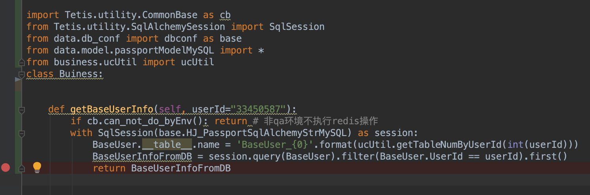
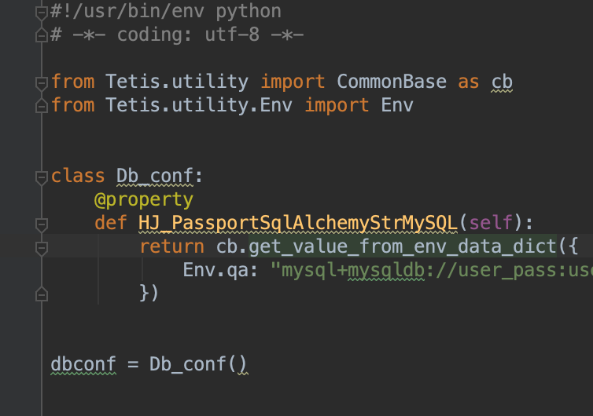

# 如何在测试用例中访问数据库

- 一般会在buiness目录中的业务代码访问数据库
    - 在这个业务代码中需要导入以下的包
        - poseidon.base.CommonBase 用来引用环境判断函数 can_not_do_byEnv()，如果是非qa环境就会跳过所有下面代码的执行（一般非qa环境是不能提供数据库访问的）
        - poseidon.base.SqlAlchemySession 用来初始化数据库连接池
        - data.db_conf.dbconf 用来存储和业务相关的数据库连接字符串
-  在data目录下的.py文件，保存数据库连接字符串的配置
-  在poseidon/base/SqlAlchemySession.py 有建立数据库连接的公共方法

 

